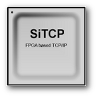

Read this in other languages: [English](README.md), [日本語](README.ja.md)

# SiTCP Sample Code for KC705 SFP

KC705通信確認用のSiTCPサンプルソースコード（SFP版）です。

SiTCPの利用するAT93C46のインタフェースをKC705のEEPROM(M24C08)に変換するモジュールを使用しています。

また、KC705に搭載されているI2CスイッチPCA9548Aを動作させるモジュールも使用しています。

KC705へSFPモジュール挿入時、SGMIIと1000BASE-Xの自動判別機能が動作します。

## SiTCP とは

物理学実験での大容量データ転送を目的としてFPGA（Field Programmable Gate Array）上に実装されたシンプルなTCP/IPです。

* SiTCPについては、[SiTCPライブラリページ](https://www.bbtech.co.jp/products/sitcp-library/)を参照してください。
* その他の関連プロジェクトは、[こちら](https://github.com/BeeBeansTechnologies)を参照してください。

## 履歴

#### 2022-06-07 Ver.1.0.1
* 「kc705sitcp.v」
    * ポート名を修正
    * DIPスイッチ割り当てを変更
    * 誤記修正
* 「RBCP.v」
    * 回路記述を変更
* 「kc705sitcp.xdc」
    * ポート名を修正

#### 2018-11-12 Ver.1.0.0

* 新規登録。